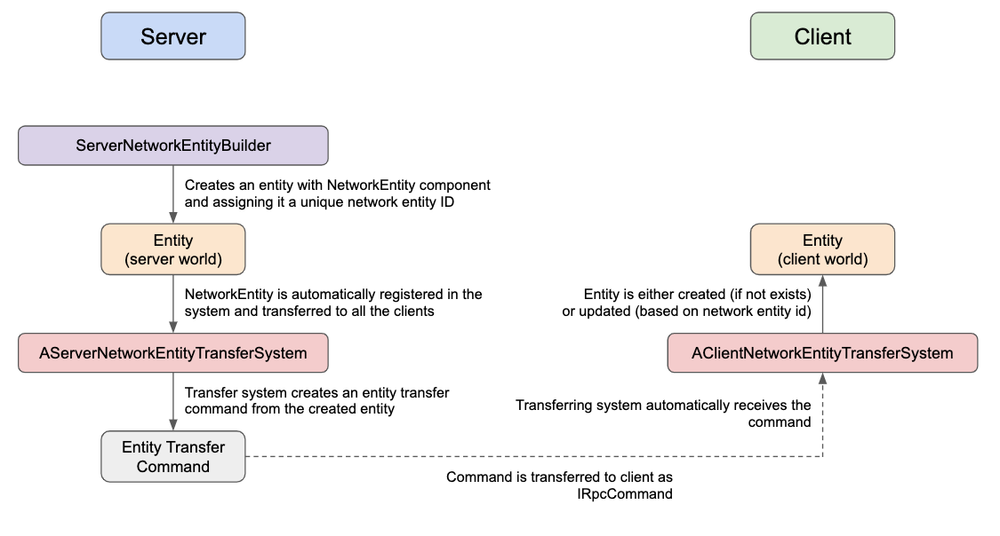

# ECSPowerNetcode

The library is made on top of the [Unity Netcode](https://docs.unity3d.com/Packages/com.unity.netcode@0.1/manual/index.html) package and saves you some time on configuring it / provides tools for client-server communication.

# Table of Contents

* [Install](#install)
  * [Dependencies](#dependencies)
* [Getting started](#getting-started)
* * [Starting a server and connecting to it locally](#starting-a-server-and-connecting-to-it-locally)
* * [Connecting to a remote server](#connecting-to-a-remote-server)
* * [Accessing connection's entities](#accessing-connections-entities)
* * [Handlers](#handlers)
* [Groups](#groups)
* [Command builders](#command-builders)
* [Command handlers](#command-handlers)
* [Synchronizing entities](#synchronizing-entities)
* * [Creating an entity on server side](#creating-an-entity-on-server-side)
* * [Transferring the entity](#transferring-the-entity)
* * [Creating the entity on the client side](#creating-the-entity-on-the-client-side)
* * [Synchronizing the entity](#synchronizing-the-entity)
* * [Destroying the entity](#destroying-the-entity)
* * [Customization](#customization)
* [Synchronizing components](#synchronizing-components)
* [Managed RPC commands](#managed-rpc-commands)

# Install

You can either just put the files into `Assets/Plugins/ECSEntityBuilder` or use it as a submodule:
```sh
git submodule add https://github.com/actionk/ECSPowerNetcode.git Assets/Plugins/ECSPowerNetcode
```

## Dependencies

The library depends on:
* [UnityECSEntityBuilder](https://github.com/actionk/UnityECSEntityBuilder)
* [Unity Netcode 0.1](https://docs.unity3d.com/Packages/com.unity.netcode@0.1/manual/index.html)

These are required dependencies

# Getting started

### Starting a server and connecting to it locally

```cs
ServerManager.Instance.StartServer(7979);
ClientManager.Instance.ConnectToServer(7979);
```

After doing so, the library will automatically establish a connection and create command handlers for each connection in both client & server world.

### Connecting to a remote server

```cs
ClientManager.Instance.ConnectToServer(7979, "remote ip address");
```

### Accessing connection's entities

Each connection is described by these parameters:

```cs
public struct ConnectionDescription
{
    public int networkId; // unique network id value for client-server connection
    public Entity connectionEntity;
    public Entity commandHandlerEntity;
}
```

#### Client side

`ClientManager.Instance.IsConnected`

`ClientManager.Instance.ConnectionToServer` -> `ConnectionDescription` struct

#### Server side

`ServerManager.Instance.AllConnections` - getting list of all connected clients of `ConnectionDescription` struct

`ServerManager.Instance.GetClientConnectionByNetworkId`

### Handlers

#### Client

You can set your handlers for `OnConnected` & `OnDisconnected` events:

```cs
ClientManager.Instance.OnConnectedHandler += MyHandler;
ClientManager.Instance.OnDisconnectedHandler += MyHandler;
```

#### Server

You can set your handlers for `OnConnected` & `OnDisconnected` events for each player:

```cs
public delegate void OnPlayerDisconnected(int networkConnectionId);

ServerManager.Instance.OnPlayerConnectedHandler += MyHandler;
ServerManager.Instance.OnPlayerDisconnectedHandler += MyHandler;
```

# Groups

### Client

```cs
ClientConnectionSystemGroup
ClientRequestProcessingSystemGroup
ClientNetworkEntitySystemGroup
ClientGameSimulationSystemGroup
```

| Group | Description |
| --- | --- |
| ClientConnectionSystemGroup | Connection/Disconnection from server |
| ClientRequestProcessingSystemGroup | Processing requests from server |
| ClientNetworkEntitySystemGroup | Processing network entities |
| ClientGameSimulationSystemGroup | All your game simulations on client side |


### Server

```cs
ServerConnectionSystemGroup
ServerRequestProcessingSystemGroup
ServerNetworkEntitySystemGroup
ServerGameSimulationSystemGroup
```

| Group | Description |
| --- | --- |
| ServerConnectionSystemGroup | Connection/Disconnection from clients |
| ServerRequestProcessingSystemGroup | Processing requests from clients |
| ServerNetworkEntitySystemGroup | Processing network entities |
| ServerGameSimulationSystemGroup | All your game simulations on server side |

# Command builders

For making your life easier, there are command builders for both client & server commands.
First of all, you have to create an [IRpcCommand](https://docs.unity3d.com/Packages/com.unity.netcode@0.1/manual/getting-started.html) yourself.

### Client

```cs
ClientToServerRpcCommandBuilder
    .Send(new ClientPlayerLoginCommand {localPlayerSide = PlayerManager.LocalPlayerSide.LEFT})
    .Build(PostUpdateCommands);
```

Where `ClientPlayerLoginCommand` implements `IRpcCommand`

### Server


You can specify which client to send the command to:

```cs
ServerToClientRpcCommandBuilder
    .SendTo(clientConnectionEntity, command)
    .Build(PostUpdateCommands);
    
ServerToClientRpcCommandBuilder
    .SendTo(networkConnectionId, command)
    .Build(PostUpdateCommands);
```

Or you can simply broadcast:

```cs
ServerToClientRpcCommandBuilder
    .Broadcast(command)
    .Build(PostUpdateCommands);
```

# Command handlers

### Client

Simply inherit from `AClientReceiveRpcCommandSystem` to implement a client command handler for RPC command of type `ServerPlayerLoginResponseCommand` (for example):

```cs
public class ClientPlayerLoginResponseSystem : AClientReceiveRpcCommandSystem<ServerPlayerLoginResponseCommand>
{
    protected override void OnCommand(ref ServerPlayerLoginResponseCommand command, ref ReceiveRpcCommandRequestComponent requestComponent)
    {
        // process your command
    }
}
```

### Server

Simply inherit from `AServerReceiveRpcCommandSystem` to implement a server command handler for RPC command of type `ClientDropItemCommand` (for example):

```cs
public class ServerDropItemSystem : AServerReceiveRpcCommandSystem<ClientDropItemCommand>
{
    protected override void OnCommand(ref ClientDropItemCommand command, ref ReceiveRpcCommandRequestComponent requestComponent)
    {
        // process your command
    }
}
```

# Synchronizing entities

Usually your way of organizing entities in client-server architecture with ECS would look like that:


That's for, the library provides you with a way of synchronizing entities without using ghost components:



### Creating an entity on server side

You start with creating an entity builder by inheriting your builder from `ServerNetworkEntityBuilder`:

```cs
public class ServerPlayerBuilder : ServerNetworkEntityBuilder<ServerPlayerBuilder>
{
    protected override ServerPlayerBuilder Self => this;

    public static ServerPlayerBuilder Create(int networkId, Entity connection, uint playerId, PlayerManager.LocalPlayerSide localPlayerSide)
    {
        return new ServerPlayerBuilder(networkId, connection, playerId, localPlayerSide);
    }

    private ServerPlayerBuilder(int networkId, Entity connection, uint playerId, PlayerManager.LocalPlayerSide localPlayerSide) : base()
    {
        CreateFromArchetype<PlayerArchetype>(WorldType.SERVER);
        SetComponentData(new Scale {Value = 1});
        AddComponentData(new ServerPlayer
        {
            networkId = networkId,
            connection = connection,
            playerId = playerId,
            localPlayerSide = localPlayerSide
        });
    }
}
```

### Transferring the entity

Then, you create an RPC command to send the entity to the clients:

```cs
[BurstCompile]
public struct PlayerTransferCommand : INetworkEntityCopyRpcCommand
{
    public ulong NetworkEntityId => networkEntityId;

    public int networkId;
    public ulong networkEntityId;
    public uint playerId;
    public PlayerManager.LocalPlayerSide localPlayerSide;
    public float3 position;

    public void Serialize(ref DataStreamWriter writer)
    {
        writer.WriteInt(networkId);
        writer.WriteULong(networkEntityId);
        writer.WriteUInt(playerId);
        writer.WriteByte((byte) localPlayerSide);

        writer.WriteFloat(position.x);
        writer.WriteFloat(position.y);
        writer.WriteFloat(position.z);
    }

    public void Deserialize(ref DataStreamReader reader)
    {
        networkId = reader.ReadInt();
        networkEntityId = reader.ReadULong();
        playerId = reader.ReadUInt();
        localPlayerSide = (PlayerManager.LocalPlayerSide) reader.ReadByte();

        position = new float3(
            reader.ReadFloat(),
            reader.ReadFloat(),
            reader.ReadFloat()
        );
    }

    #region Implementation

    public PortableFunctionPointer<RpcExecutor.ExecuteDelegate> CompileExecute()
    {
        return INVOKE_EXECUTE_FUNCTION_POINTER;
    }

    [BurstCompile]
    private static void InvokeExecute(ref RpcExecutor.Parameters parameters)
    {
        RpcExecutor.ExecuteCreateRequestComponent<PlayerTransferCommand>(ref parameters);
    }

    private static readonly PortableFunctionPointer<RpcExecutor.ExecuteDelegate> INVOKE_EXECUTE_FUNCTION_POINTER =
        new PortableFunctionPointer<RpcExecutor.ExecuteDelegate>(InvokeExecute);

    #endregion

    #region Sender

    public class CopyPlayerCommandSender : RpcCommandRequestSystem<PlayerTransferCommand>
    {
    }

    #endregion
}
```

Then, for creating the command, you create a system inherited from `AServerNetworkEntityTransferSystem`:

```cs
[UpdateInGroup(typeof(ServerNetworkEntitySystemGroup))]
public class ServerPlayerTransferSystem : AServerNetworkEntityTransferSystem<ServerPlayer, PlayerTransferCommand>
{
    protected override PlayerTransferCommand CreateTransferCommandForEntity(Entity entity, NetworkEntity networkEntity, ServerPlayer selectorComponent)
    {
        return new PlayerTransferCommand
        {
            networkId = selectorComponent.networkId,
            networkEntityId = networkEntity.networkEntityId,
            playerId = selectorComponent.playerId,
            localPlayerSide = selectorComponent.localPlayerSide,
            position = EntityManager.GetComponentData<Translation>(entity).Value
        };
    }
}
```

### Creating the entity on the client side

And the system for consuming this command on the client side:

```cs
[UpdateInGroup(typeof(ClientEarlyUpdateSystemGroup))]
public class ClientPlayerTransferSystem : AClientNetworkEntityTransferSystem<PlayerTransferCommand>
{
    protected override void CreateNetworkEntity(ulong networkEntityId, PlayerTransferCommand command)
    {
        ClientPlayerBuilder
            .Create(command)
            .Build(EntityManager);
    }

    protected override void SynchronizeNetworkEntity(Entity entity, PlayerTransferCommand command)
    {
        EntityWrapper.Wrap(entity, PostUpdateCommands)
            .SetComponentData(new Translation {Value = command.position});
    }
}
```

That's it! When you server entity is created, it will be automatically transferred to the client side by using `TransferNetworkEntityToAllClients`, which is described below

### Synchronizing the entity

You have two possibilities of controlling that:

1. By adding `TransferNetworkEntityToAllClients` component to your network entity. This will automatically send the transfer command to all the clients connected

2. By adding a buffer of `TransferNetworkEntityToClient` and specifing the client connection to send the entity to. You can use EntityWrapper to use an existing buffer or create one if it doesn't exist:

```cs
EntityWrapper.Wrap(entity, EntityManager)
    .AddElementToBuffer(new TransferNetworkEntityToClient(reqSrcSourceConnection));
```

### Destroying the entity

When you want to destroy the entity on the server and all the clients at the same time, you can just add a `ServerDestroy` component to server entity and it will be automatically destroyed on all the clients:

```cs
PostUpdateCommands.AddComponent<ServerDestroy>(myServerEntity);
```

### Customization

You have two ways of customizing your network entities:

#### Custom network entity manager

The default network entity manager is `DefaultNetworkEntityManager` which implements `INetworkEntityManager`. You can just implement `INetworkEntityManager` on your own and set the entity manager for server/client:

```cs
ClientManager.Instance.NetworkEntityManager = myEntityManager;
ServerManager.Instance.NetworkEntityManager = myEntityManager;
```

#### Custom network entity id factory

The default factory implementation is `DefaultNetworkEntityIdFactory`. However, you can also implement your own factory by implementing `INetworkEntityIdFactory` and replacing the default one:

```cs
ServerManager.Instance.NetworkEntityIdFactory = myEntityManager;
```

As you can see, it only works for server-side as the server is the one who assign the IDs.

# Synchronizing components

As an alternatives to Unity Netcode's Ghosts, the lib provides a way of synchronizing components automatically from server to all clients.

### Defining a component

Here is the example:

```cs
[assembly: RegisterGenericComponentType(typeof(CopyEntityComponentRpcCommand<Velocity, VelocityConverter>))]

namespace Entities.Players.Packets
{
    public struct Velocity : IComponentData
    {
        public float3 value;

        public bool IsZero => math.lengthsq(value) <= 0.001f;
    }

    public struct VelocityConverter : ISyncEntityConverter<Velocity>
    {
        public Velocity velocity;
        public Velocity Value => velocity;

        public void Convert(Velocity value)
        {
            velocity = value;
        }

        public void Serialize(ref DataStreamWriter writer)
        {
            writer.WriteFloat(velocity.value.x);
            writer.WriteFloat(velocity.value.y);
            writer.WriteFloat(velocity.value.z);
        }

        public void Deserialize(ref DataStreamReader reader)
        {
            velocity.value = new float3(
                reader.ReadFloat(),
                reader.ReadFloat(),
                reader.ReadFloat()
            );
        }
    }

    public class VelocityRpcCommandSender : RpcCommandRequestSystem<CopyEntityComponentRpcCommand<Velocity, VelocityConverter>>
    {
    }

    public class VelocityServerSyncSystem : ServerSyncComponentSystem<Velocity, VelocityConverter>
    {
    }

    public class VelocityClientSyncSystem : ClientSyncComponentSystem<Velocity, VelocityConverter>
    {
        protected override bool ShouldApply(Entity entity, ref CopyEntityComponentRpcCommand<Velocity, VelocityConverter> command)
        {
            return !EntityManager.HasComponent<LocalPlayer>(entity);
        }
    }
}
```

This way when you add a `Velocity` component to an entity which also has `NetworkEntity` component, the `Velocity` component will be automatically synchronized.

### Triggering synchronization

For triggering synchronization process for all the components on the entities, add `Synchronize` component to the entity.

### Transform synchronization

You can also synchronize all transform components in one command by just adding `SyncTransformFromServerToClient` to any entity in server world which has `NetworkEntity` component as well.

If you don't want to recieve such updates on the client side (for example, when you're controlling your character, you don't want to receive updates about his/her position), you can just add `IgnoreTransformCopyingFromServer` component to this entity in client world.

# Managed RPC commands

Sometimes you want to have control over the requests you send to server. For example, when you send a request to perform an action and you wait until the server confirms it. In this case, you need to get a response to that exact request you sent and react to that response. You can do that with so-called managed rpc commands.

First of all, you should create your command which should implement `IManagedRpcCommand` instead of `IRPCCommand`. This interface adds a `PacketId` field that will be filled automatically.

### Client

Then, you send a message to a server using `ClientToServerManagedRpcCommandBuilder`:

```cs
ClientToServerManagedRpcCommandBuilder
    .Send(new MyManagedCommand())
    .AddEntityWaitingForResult(myEntity)
    .Build(PostUpdateCommands)
```

### Server

To recieve the command on the server side and process it, you should create a system that implements `AServerReceiveManagedRpcCommandSystem`:

```cs
class MyCommandRecieveSystem : AServerReceiveManagedRpcCommandSystem<MyManagedCommand> {
    protected int OnCommand(ref T command, ref ReceiveRpcCommandRequestComponent requestComponent) {
        // process command
        return (int)MyStatusEnum.SUCCESS;
    }
}
```

`OnCommand` expects you to return a status int that will be sent back to the client.

Once you respond, the response will be sent back to the client and added to the entity which is waiting for it: `.AddEntityWaitingForResult(myEntity)`.
The added component is described below:

```cs
public struct ManagedRpcCommandResponse : IComponentData
{
    public ulong packetId;
    public int result;
}
```
